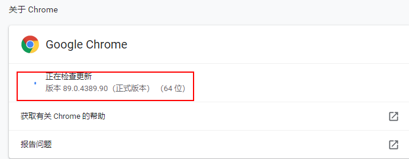

# Jupyter Lab在线安装笔记

## 2.接着要去添加两个ython的系统变量，如图：

## 3.接着进入Python的Scripts文件夹，如图：

## 4.在Scripts文件下按`Shift + 鼠标右击`,选择`在此处打开Powershell窗口（S）`,如图：

## 5.在进入到`Windows PowerShell`窗口中，输入`pip install jupyterlab`进行安装，然后等待安装完成。安装完成之后，再输入`pip install notebook`等待安装完成，再输入`pip install voila`等待安装完成。

## 6.安装完成后，可以在`Windows PowerShell`中输入`pip show jupyterlab`来查看是否安装成功，如果弹出以下信息，说明安装完成，如图：

## 7.接着我们启动`CMD`(命令提示符),CMD窗口里输入`jupyter lab F:/jupyter_lab_cache`命令来启动jupyterlab服务器，注意这里的`F:/jupyter_lab_cache`是存放jupyterlab的文件的，可以自行设置。如图：

## 8.最后启动成功以后，会自动跳转到浏览器中打开jupyterlab界面，如果没有自动弹到浏览器上，也可以通过手动复制服务器地址来打开，如图：

### 温馨提示：如果是使用Google浏览器，一定要使用88.0以上的版本，否则可能会造成部分图标显示有问题，如图：

## 9.以上就是JupyterLab在线安装的教程。
